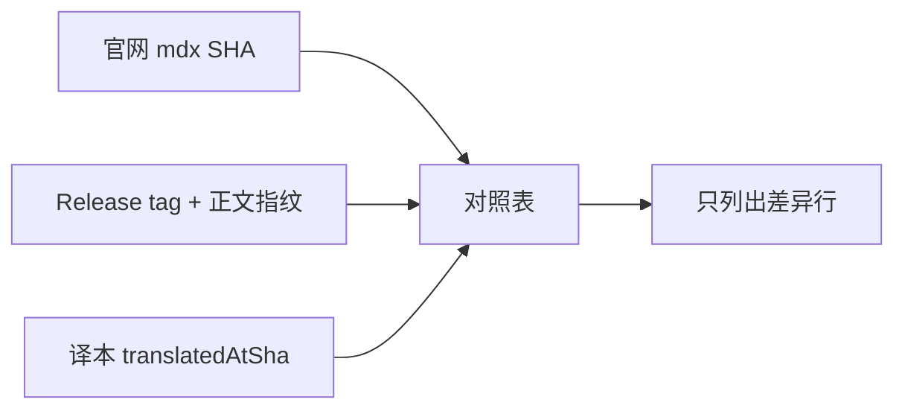

# 对照表 {#sitemap}

每次跟上官网，不必把 57 页再读一遍。这里记下**每页的官方 blob SHA**和**每个桌面版 Release 的正文指纹**；官方一改，只亮有差异的那几行。

命令、产品名、`/docs/...` 路径保持英文。官网 57 页仍是 1:1 译本；本页和 [快速手册](/docs/quick-guide)、[更新日志](/docs/changelog)、[本站架构](/docs/architecture)、[命令使用](/docs/cli/commands) 一样，是本站加页。

## 怎么用 {#how-to-use}

1. 打开本页，阅读器会抓取官网 `docs/site/content/docs` 的树和 GitHub Releases（缓存 6 小时）。
2. **手册待更新** = 这一页的官方 SHA 和上次汉化时记下的 SHA 不同。点中文标题改这一页，不必全站搜索。
3. **新页** = 官网多了一个 mdx，侧栏还没有对应译本。
4. **官方已删** = 指纹里有、官网上没了。
5. **Release 待汉化 / 正文有改动** = 新桌面版 tag，或同一 tag 的说明被改写（例如 v1.4.202 下架后由 v1.4.203 取代）。
6. **复制待办** 只复制差异清单，给下一次汉化当工单。

一致的页保持静默。内部目录 `docs/reference` 等不在这张表里。
